## System Architecture Blueprint

### App Summary

**End Goal:** Microbiome restoration platform that teaches users to grow nutrient-dense food through soil-based gardening with 4+ plant families, leveraging root-to-root microbe exchange and quorum sensing for health transformation.

**Template Foundation:** rag-saas template with complete RAG pipeline (multi-modal document processing, dual embeddings, vector search, streaming AI chat), Supabase authentication, Stripe three-tier billing, usage tracking.

**Required Extensions:** Domain-specific microbiome knowledge schema (9 new tables), global climate intelligence (hemisphere-aware, condition-based), Growing Knowledge Path assessment (conversion funnel), personalized health-goal-to-plant recommendations, admin content management system.

---

## 🏗️ System Architecture

### Template Foundation

**Your Chosen Template:** rag-saas

**Built-in Capabilities:**

- **Authentication & User Management** - Supabase auth with role-based access (member/admin)
- **Database Infrastructure** - PostgreSQL with Drizzle ORM, pgvector for vector similarity search
- **Multi-Modal RAG Pipeline** - Complete document processing flow:
  - Cloud Storage upload with signed URLs
  - GCS event-triggered processing (Cloud Function)
  - Python FastAPI processor service (Docling parser, semantic chunking)
  - Dual embedding strategy: text-embedding-004 (768d) + multimodalembedding@001 (1408d)
  - HNSW vector indexes with cosine similarity
  - Supports PDF, images, video, audio
- **AI Chat Interface** - Streaming chat with context retrieval using Google Gemini 2.5
- **Subscription & Billing** - Stripe integration with three-tier system (Free/Basic/Pro)
- **Usage Tracking** - Usage events table for tier limit enforcement
- **Deployment** - Vercel (frontend) + Cloud Run services (backend processing)

### Architecture Diagram

```mermaid
graph TB
    subgraph "User Interface Layer"
        Landing[Landing Page]
        Assessment[Growing Knowledge Path Assessment]
        Documents[Knowledge Base Browser]
        Chat[AI Microbiome Chat]
        Profile[Growing Profile]
        Admin[Admin Knowledge Manager]
    end

    subgraph "Application Layer - Template Foundation"
        AuthAPI[Supabase Auth API]
        ChatAPI[Streaming Chat API - /api/chat]
        StripeAPI[Stripe Webhook API]
        DocumentAPI[Document Upload API]
    end

    subgraph "Application Layer - Extensions"
        AssessmentAPI[Assessment Scoring API]
        ClimateAPI[Climate Intelligence API]
        RecommendationAPI[Plant Recommendation API]
        AdminAPI[Admin Knowledge Update API]
    end

    subgraph "Data Layer - Template Foundation"
        UsersTable[(users - Stripe customers, roles)]
        ConversationsTable[(conversations)]
        MessagesTable[(messages)]
        DocumentsTable[(documents - GCS paths, status)]
        ChunksTable[(document_chunks - dual embeddings)]
        JobsTable[(document_processing_jobs)]
        UsageTable[(usage_events - tier limits)]
    end

    subgraph "Data Layer - Extensions"
        ProfileData[(users extended - location, hemisphere, climate, pets, goals)]
        PlantFamilies[(plant_families - microbiome data)]
        Plants[(plants - growing guides, brix targets)]
        HealthGoals[(user_health_goals - junction table)]
        Assessments[(assessments + responses - conversion tracking)]
        Articles[(research_articles + tags - separate from documents)]
        Premium[(garden_activities + brix_measurements - Phase 2)]
    end

    subgraph "RAG Processing Pipeline - Cloud Run"
        ProcessorService[RAG Processor - FastAPI]
        GCSHandler[GCS Event Handler - Cloud Function]
        TaskProcessor[Task Queue Processor]

        subgraph "Processing Services"
            DocParser[Docling - PDF/Text Extraction]
            Chunker[Semantic Chunking Service]
            TextEmbed[Vertex AI - text-embedding-004<br/>768 dimensions]
            MultimodalEmbed[Vertex AI - multimodalembedding@001<br/>1408 dimensions]
        end
    end

    subgraph "Storage Layer"
        GCS[Google Cloud Storage - Documents & Media]
        VectorIndex[pgvector HNSW Indexes<br/>Text: 768d cosine<br/>Multimodal: 1408d cosine]
    end

    subgraph "External Services"
        GeminiAPI[Google Gemini 2.5 - Chat AI]
        StripeService[Stripe - Subscription Billing]
        SupabaseAuth[Supabase - Authentication]
        VertexAI[Vertex AI - Embeddings]
    end

    %% User Interface Connections
    Landing -->|signup/login| AuthAPI
    Assessment -->|submit answers| AssessmentAPI
    Documents -->|browse articles| DocumentAPI
    Chat -->|ask questions| ChatAPI
    Profile -->|update location/goals| ClimateAPI
    Admin -->|correct content| AdminAPI

    %% Application Layer - Template
    AuthAPI -->|validate| SupabaseAuth
    ChatAPI -->|retrieve context| ChunksTable
    ChatAPI -->|generate response| GeminiAPI
    StripeAPI -->|webhook events| StripeService
    DocumentAPI -->|signed URL| GCS

    %% Application Layer - Extensions
    AssessmentAPI -->|score & save| Assessments
    AssessmentAPI -->|detect hemisphere| ProfileData
    ClimateAPI -->|match climate conditions| ProfileData
    RecommendationAPI -->|match goals→plants| HealthGoals
    RecommendationAPI -->|filter by hemisphere| Plants
    AdminAPI -->|update knowledge| Articles
    AdminAPI -->|update plant data| Plants

    %% RAG Pipeline Flow
    GCS -.->|upload event| GCSHandler
    GCSHandler -.->|create job| JobsTable
    GCSHandler -.->|trigger| TaskProcessor
    TaskProcessor -->|fetch job| JobsTable
    TaskProcessor -->|download| GCS
    TaskProcessor -->|process| ProcessorService

    ProcessorService -->|parse| DocParser
    DocParser -->|chunk| Chunker
    Chunker -->|text content| TextEmbed
    Chunker -->|images/video| MultimodalEmbed
    TextEmbed -->|768d vectors| ChunksTable
    MultimodalEmbed -->|1408d vectors| ChunksTable
    ChunksTable -->|build index| VectorIndex

    %% Data Layer Connections
    UsersTable -.->|extend with| ProfileData
    DocumentsTable -.->|specialized| Articles
    ChunksTable -->|similarity search| ChatAPI
    HealthGoals -->|many-to-many| ProfileData
    HealthGoals -->|many-to-many| PlantFamilies
    Plants -->|belongs to| PlantFamilies
    Articles -->|chunks & embeddings| ChunksTable
    Assessments -->|user responses| ProfileData

    %% Usage & Billing
    ChatAPI -->|log request| UsageTable
    DocumentAPI -->|log upload| UsageTable
    UsageTable -->|enforce limits| StripeService

    %% Styling
    classDef userInterface fill:#1E88E5,stroke:#1565C0,stroke-width:2px,color:#fff
    classDef frontend fill:#42A5F5,stroke:#1976D2,stroke-width:2px,color:#fff
    classDef backend fill:#66BB6A,stroke:#388E3C,stroke-width:2px,color:#fff
    classDef database fill:#4CAF50,stroke:#2E7D32,stroke-width:2px,color:#fff
    classDef aiServices fill:#AB47BC,stroke:#7B1FA2,stroke-width:2px,color:#fff
    classDef processing fill:#8E24AA,stroke:#6A1B9A,stroke-width:2px,color:#fff
    classDef external fill:#FF7043,stroke:#D84315,stroke-width:2px,color:#fff
    classDef payment fill:#FFA726,stroke:#F57C00,stroke-width:2px,color:#fff
    classDef storage fill:#26A69A,stroke:#00695C,stroke-width:2px,color:#fff

    class Landing,Assessment,Documents,Chat,Profile,Admin userInterface
    class AuthAPI,ChatAPI,StripeAPI,DocumentAPI,AssessmentAPI,ClimateAPI,RecommendationAPI,AdminAPI backend
    class UsersTable,ConversationsTable,MessagesTable,DocumentsTable,ChunksTable,JobsTable,UsageTable,ProfileData,PlantFamilies,Plants,HealthGoals,Assessments,Articles,Premium database
    class ProcessorService,GCSHandler,TaskProcessor,DocParser,Chunker processing
    class TextEmbed,MultimodalEmbed,GeminiAPI,VertexAI aiServices
    class StripeService,SupabaseAuth external
    class GCS,VectorIndex storage
```

### Extension Strategy

**Why These Extensions:** Transform generic RAG-SaaS into specialized microbiome restoration platform with personalized growing guidance

**Integration Points:**

- **Research Articles** - Use template's document upload flow, store in GCS, process through existing RAG pipeline, add rich metadata in separate research_articles table
- **Assessment System** - New API endpoints and tables, but leverage existing user profiles and Stripe tier logic for feature gating
- **Climate Intelligence** - Extend user profile with location/hemisphere/climate fields, filter plant recommendations server-side
- **Health Goal Matching** - Junction table connects users to health_goals to plant_families to plants, enables personalized RAG context
- **Admin Content Management** - Update knowledge tables directly, mark affected chunks for asynchronous re-embedding

**Avoided Complexity:**

- No separate content ingestion system - reuse RAG pipeline for all knowledge base uploads
- No microservices sprawl - extend existing Cloud Run services with new API routes
- No custom vector database - pgvector with HNSW indexes sufficient for scale
- No complex caching layer - PostgreSQL query performance adequate for MVP
- No custom ML models - leverage Vertex AI embeddings already in template
- No hardcoded climate zones - condition-based matching, global from day one

### System Flow Explanation

**Template Foundation Flow:**

1. **Authentication** - Supabase auth validates users, row-level security enforces access control
2. **Document Upload** - Frontend requests signed URL, uploads to GCS, GCS event triggers Cloud Function
3. **RAG Processing** - Cloud Function creates job, Task Processor downloads file, FastAPI service parses with Docling, chunks semantically
4. **Embedding Generation** - Content type detection routes to text-embedding-004 (768d) or multimodalembedding@001 (1408d)
5. **Vector Storage** - Chunks and embeddings stored in document_chunks table with pgvector, HNSW indexes built
6. **Chat Retrieval** - User query embedded, vector similarity search retrieves relevant chunks, context injected into Gemini prompt
7. **Streaming Response** - Gemini generates answer with context, streams back to frontend via AI SDK

**Extension Integration:**

1. **Discovery & Conversion**
   - User lands on public site, sees two-track messaging (public education vs member benefits)
   - Takes Growing Knowledge Path assessment, answers 5-7 core questions
   - Assessment API detects hemisphere from location (latitude-based), scores responses, stores in assessments + assessment_responses tables
   - Profile extended with location, hemisphere, climate_type, initial health goals

2. **Personalized Learning**
   - User browses knowledge base (research articles), RAG-powered semantic search finds relevant content
   - Articles processed through template's RAG pipeline, metadata stored in research_articles table
   - AI chat retrieves context filtered by user's health goals (junction table join), hemisphere-appropriate plants
   - Recommendations API matches health goals → plant families → specific plants, filters by climate compatibility

3. **Ongoing Engagement**
   - User updates profile with new health goals, system recalculates plant recommendations
   - Premium tier unlocks garden activity tracking, Brix measurements (Phase 2 tables)
   - Usage events logged for chat requests, document views, tier limits enforced via existing Stripe logic

4. **Content Quality Management**
   - Admin logs in (role-based access), sees knowledge manager interface
   - Updates research article content, plant family data, plant growing guides inline
   - Admin API updates database records immediately (users see changes)
   - Affected document chunks marked as "stale", background job re-embeds only changed content

---

## ⚠️ Technical Risk Assessment

### ✅ Template Foundation Strengths (Low Risk)

**Proven RAG Pipeline** - Cloud Run processing flow (GCS → Cloud Function → Task Queue → FastAPI → Docling → embeddings → pgvector) is production-tested. Document processing is solved.

**Dual Embedding Strategy** - Text-embedding-004 (768d) + multimodalembedding@001 (1408d) with separate HNSW indexes is the right architecture. Content type detection and routing already implemented.

**Vector Search Performance** - pgvector with HNSW indexes + cosine similarity gives sub-100ms retrieval at scale. No custom vector database needed.

**Subscription Infrastructure** - Stripe webhook handling, usage event tracking, tier limit enforcement already complete. Billing logic works out of the box.

**Authentication & Security** - Supabase auth with row-level security policies, role-based access control (member/admin) production-ready.

### ⚠️ Extension Integration Points (Monitor These)

**Hemisphere Detection Accuracy** - Assessment must correctly detect Northern/Southern hemisphere from location input to provide accurate growing guidance

- **Mitigation Strategy:** Simple geolocation lookup (latitude-based: positive = Northern, negative = Southern). Validate during assessment submission before saving to profile.

**Global Climate Personalization** - Condition-based recommendations need to work across all climates without US zone dependency

- **System-Level Approach:** Store climate descriptors (temperature ranges, frost dates, growing season length) not hardcoded zones. Match plant requirements to user conditions, not zone numbers.

**Assessment Conversion Funnel** - Growing Knowledge Path must capture enough data to provide valuable personalized recommendations without feeling overwhelming

- **Mitigation Strategy:** Progressive disclosure - start with 5-7 core questions (location, goals, experience), offer "learn more" path for deeper assessment. Track completion rates in analytics.

**Admin Content Corrections** - Knowledge base updates must propagate to RAG context without reprocessing all embeddings

- **System-Level Approach:** When admin updates research article or plant data, update database record immediately (users see changes). For RAG embeddings, mark affected chunks as "stale" and reprocess only those chunks asynchronously. Most updates are metadata (not content requiring re-embedding).

**Junction Table Query Performance** - user_health_goals many-to-many relationship could create N+1 query problems when loading personalized recommendations

- **Mitigation Strategy:** Use Drizzle's `.with()` eager loading to fetch user → health_goals → plant_families → plants in single query. Add database index on user_id in junction table.

**9 New Tables Data Integrity** - Schema extensions must maintain referential integrity across assessments → profile → goals → families → plants

- **System-Level Approach:** Use Drizzle foreign key constraints, cascading deletes where appropriate. Write database migration tests to validate relationships before deploying schema changes.

### 🟢 Smart Architecture Decisions

**RAG Pipeline Reuse** - Leveraging existing document processing infrastructure for research articles instead of building separate content ingestion system. Eliminates entire category of complexity.

**Separate Article Metadata** - Creating research_articles table separate from documents while still using document_chunks for embeddings is the right separation of concerns. Articles get rich metadata (tags, categories) without cluttering generic documents table.

**Normalized Assessment Design** - Storing one row per answer in assessment_responses instead of JSONB blob enables analytics and personalization queries. Easy to answer "which users care about gut health?" without parsing unstructured data.

**Phase 2 Premium Separation** - Deferring garden_activities and brix_measurements tables to Phase 2 keeps MVP focused. These are value-add features that don't block core RAG functionality.

**No Microservices Sprawl** - Extending existing Cloud Run services instead of creating new microservices for assessment/climate/recommendation APIs. Less operational overhead, simpler deployment.

**Template-First Billing** - Using existing Stripe subscription tiers (Free/Basic/Pro) with usage_events tracking. No custom billing logic needed - just add feature flags based on tier.

---

## 🏗️ Implementation Strategy

### Phase 1 (Leverage Template Foundation)

**Start with template capabilities, minimal custom development:**

1. **Database Schema Extensions**
   - Add 9 new tables via Drizzle migrations (plant_families, plants, research_articles, user_health_goals, assessments, assessment_responses, article_tags)
   - Extend users table with location, hemisphere, climate_type, pets fields
   - Create foreign key constraints and indexes

2. **Assessment System**
   - Build Growing Knowledge Path UI (5-7 core questions)
   - Implement Assessment API for scoring and hemisphere detection
   - Store responses in normalized assessment_responses table
   - Extend user profile with assessment results

3. **Knowledge Base Content**
   - Upload initial research articles through template's document upload flow
   - Create research_articles metadata records (link to documents table)
   - Seed plant_families and plants tables with initial microbiome data
   - Articles automatically processed through existing RAG pipeline

4. **Personalized Recommendations**
   - Implement Recommendation API with health goal → plant family → plant matching
   - Add hemisphere and climate filtering logic
   - Leverage existing chat API, inject personalized context based on user profile

### Phase 2 (Add Required Extensions)

**Implement only the additional services you actually need:**

1. **Climate Intelligence**
   - Build Climate API for condition-based matching (no zone dependency)
   - Store climate descriptors (temperature ranges, frost dates, season length)
   - Match plant requirements to user conditions server-side

2. **Admin Content Management**
   - Create admin knowledge manager UI with inline editing
   - Implement Admin API for updating articles, plant data, family information
   - Build background job for selective re-embedding of updated chunks

3. **Premium Features (Phase 2)**
   - Add garden_activities table and tracking UI
   - Add brix_measurements table and measurement logging
   - Gate features by subscription tier using existing Stripe logic

### Integration Guidelines

**How to connect extensions to template without breaking existing functionality:**

- **Use Drizzle migrations** - Never modify template tables directly, always extend via new migrations
- **Leverage existing APIs** - Add new routes to existing Next.js API structure, don't create separate services
- **Reuse RAG pipeline** - Upload research articles through document upload flow, add metadata separately
- **Extend user profile gradually** - Add optional fields to users table, maintain backward compatibility
- **Follow template patterns** - Use same auth middleware, error handling, logging as template
- **Test incrementally** - Each schema change should be deployable independently with rollback plan

---

## 🛠️ Development Approach

### Template-First Development

**Maximize use of existing template features before adding complexity:**

- Start with template's RAG pipeline working end-to-end (document upload → processing → chat)
- Use existing Stripe billing flow, only add feature flags for microbiome-specific features
- Leverage Supabase auth and row-level security for all new pages
- Follow template's deployment patterns (Vercel + Cloud Run)

### Minimal Viable Extensions

**Add services only when template capabilities aren't sufficient:**

- Assessment system needed for conversion funnel (not in template)
- Climate intelligence needed for global personalization (not in template)
- Recommendation API needed for health goal matching (not in template)
- Admin content management needed for knowledge base corrections (not in template)
- Everything else use template as-is

### Extension Integration Patterns

**Proven patterns for safely extending your chosen template:**

- **Database extensions** - Drizzle migrations with foreign keys to template tables
- **API extensions** - New routes in `app/api/` following template's auth middleware pattern
- **UI extensions** - New pages in `app/(protected)/` using template's layout and auth
- **Content specialization** - research_articles metadata table links to template's documents table
- **Profile extensions** - Optional fields added to users table, backward compatible

---

## 🎯 Success Metrics

This system architecture supports your core value proposition: **Teaching users to grow nutrient-dense food through microbiome restoration with 4+ plant families, leveraging root-to-root microbe exchange and quorum sensing for health transformation.**

**Template Optimization:** Leverages complete RAG pipeline (multi-modal processing, dual embeddings, vector search, streaming chat), Stripe billing, Supabase auth while adding domain-specific microbiome knowledge schema, global climate intelligence, assessment conversion funnel, personalized recommendations.

**Focused Extensions:** Adds only the services needed for specialized microbiome knowledge management, hemisphere-aware climate guidance, health-goal-to-plant matching, admin content corrections.

**Reduced Complexity:** Avoids over-engineering by reusing RAG pipeline for all content, extending existing Cloud Run services instead of creating microservices, leveraging template billing and auth, using condition-based climate matching instead of hardcoded zones.

> **Next Steps:** Ready for implementation - start with database schema extensions (9 new tables), then build assessment system, populate knowledge base through existing RAG pipeline, implement personalized recommendation API, add admin content management.
